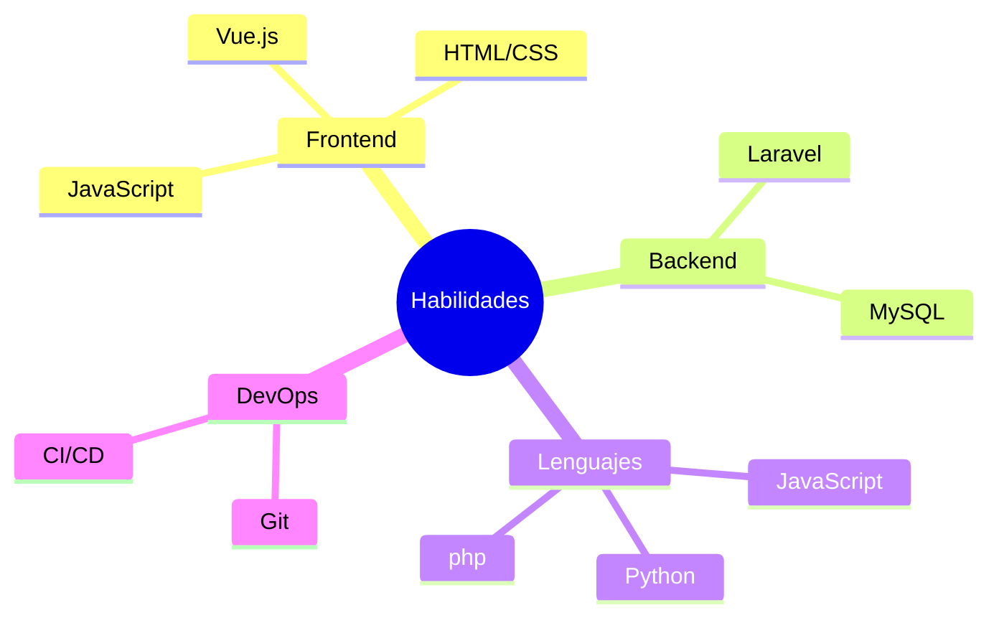

# ¡Hola, soy Álvaro! 👋

## 👨‍💻 Desarrollador Full Stack

Soy un Desarrollador Web con experiencia en Vue.js, Laravel, Git, MySQL y Bootstrap. Apasionado por las matemáticas y la programación desde joven, valoro el desarrollo personal y profesional, manteniendo un estilo de vida equilibrado con el gimnasio como hobby.

Tengo habilidades para el trabajo en equipo, resolución de problemas y adaptación. Mi experiencia en roles administrativos y comerciales me permite ofrecer soluciones prácticas y alineadas con las necesidades del cliente.

Busco oportunidades en empresas que ofrezcan productos digitales, especialmente en aquellas que integren inteligencia artificial. Estoy listo para asumir nuevos retos y crecer profesionalmente. ¡Contáctame!

## 🚀 Mis habilidades

## 📊 Mis estadísticas de GitHub

## 🌱 Actualmente estoy aprendiendo

- Profundizando en desarrollo Web con Vue y Django

## 💡 Intereses

- 🧠 Inteligencia Artificial
- 🌐 Desarrollo Web Moderno
- 🏗️ Ingeniería de Software
- 🚀 Nuevas tecnologías

## 📫 Conéctate conmigo

## 🎯 Objetivos para 2024

- Adquirir experiencia en en la indusrtia tecnológica profesional.
- Desarrollar mis habilidades para mejorar como desarrollaodr.

---

  

  "La ingeniería es el arte de modelar materiales que no comprendemos, en formas que no podemos analizar, para soportar fuerzas que no podemos prever, de tal manera que el público no tiene razón para sospechar la extensión de nuestra ignorancia." - Dr. AR Dykes

