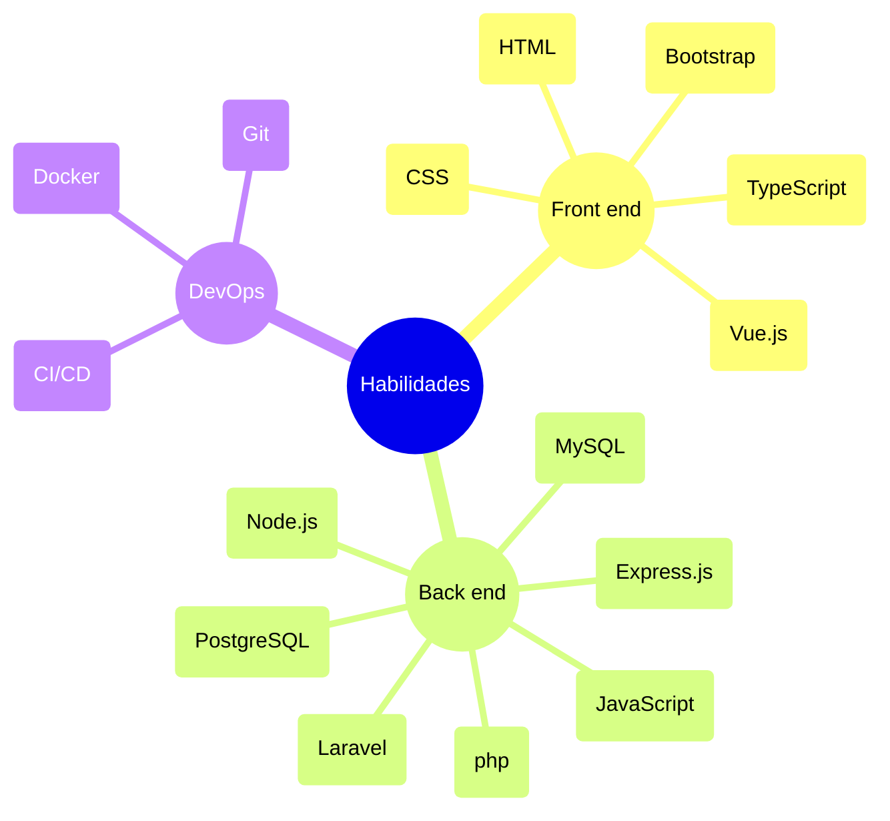

# ¡Hola, soy Álvaro! 👋

## 👨‍💻 Desarrollador Full Stack

Soy un Desarrollador Web con experiencia en Vue.js, Laravel, Git, MySQL y Bootstrap. Apasionado por las matemáticas y la programación desde joven, valoro el desarrollo personal y profesional, cuido mi cuerpo y exploro nuevas tecnologías y ciencias como hobby.

Tengo habilidades para el trabajo en equipo, resolución de problemas y adaptación. Mi experiencia en roles administrativos y comerciales me permite ofrecer soluciones prácticas y alineadas con las necesidades de cliente comerciales.

Busco oportunidades en la industria, me llama la atención trabajar con productos robustos y escalables, también, la inteligencia artificial. Estoy listo para asumir nuevos retos y crecer profesionalmente. ¡Contáctame!

## 🚀 Mis habilidades

```mermaid
mindmap
  root((Habilidades))
    ((Front end))
      (HTML)
      (CSS)
      (TypeScript)
      (Vue.js)
      (Bootstrap)
    ((Back end))
      (Laravel)
      (php)
      (MySQL)
      (PostgreSQL)
      (JavaScript)
      (Node.js)
      (Express.js)
    ((DevOps))
      (Git)
      (CI/CD)
      (Docker)
```

## 📊 Mis estadísticas de GitHub

## 🌱 Actualmente estoy aprendiendo

- Nest

## 💡 Intereses

- 🌐 Desarrollo Web Moderno
- 🧠 Inteligencia Artificial
- 🏗️ Ingeniería de Software

## 📫 Conéctate conmigo

-  ,
   O
  

## 🎯 Objetivos para 2026

- Adquirir experiencia profesional en la industria tecnológica.
- Mejorar mis habilidades técnicas como desarrollador.

---

<!-- 

  

 -->

  

> "La ingeniería es el arte de modelar materiales que no comprendemos, en formas que no podemos analizar, para soportar fuerzas que no podemos prever, de tal manera que el público no tiene razón para sospechar la extensión de nuestra ignorancia." - Dr. AR Dykes
